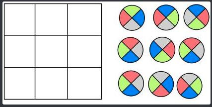

# Riddle of the Magic Door




Place each tile to the grid. Adjacent colors must match. Tiles may be rotated.

## Implementation
Nondeterministic, partial correct algorithm\
Runs randomly through nonoptimised 9! * 4^9 possibilities, till it finds a valid.

## Run
```bash
node Riddle.mjs
```

## Thanks to
[SebastianBaltes](https://github.com/SebastianBaltes) who brought up the riddle
